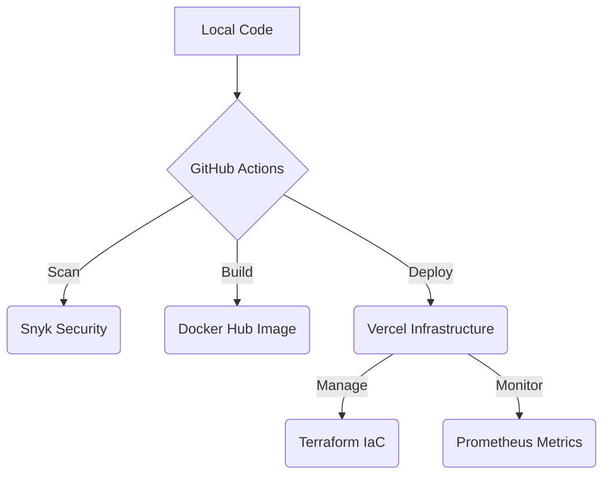

# Professional DevOps Guide

This repository has been transformed into a professional-grade DevOps showcase, implementing industry-standard security, infrastructure, and observability patterns.

## 🚀 What's been added:

### Professional CI/CD ([`.github/workflows/main.yml`](./.github/workflows/main.yml)):
- **Snyk**: Scans for security bugs before every build.
- **Docker**: Automatically builds and pushes a container to Docker Hub.
- **Lighthouse**: Audits your site's SEO and Performance on every PR.
- **Discord**: Pings you with Success/Failure updates.

### Infrastructure-as-Code ([`terraform/main.tf`](./terraform/main.tf)):
- Your Vercel setup is now version-controlled using Terraform.

### Observability ([`metrics/route.js`](./app/api/metrics/route.js)):
- Implemented a Prometheus-compatible metrics endpoint to track site usage and "Game Starts."

## 🗺 Dependency Map

---

## 🛠 Run Sequence (The Pipeline)

1.  **Security**: Every push is scanned by **Snyk** for dependency vulnerabilities. If a "High" severity bug is found, the build stops.
2.  **Verify**: **Vitest** runs all unit tests to ensure code logic is sound.
3.  **Build**: A production-ready **Docker Image** is built and pushed to your registry, ensuring environment parity.
4.  **Deploy**: The app is deployed to **Vercel** infrastructure.
5.  **Quality**: **Lighthouse CI** audits the URL for Performance, SEO, and Accessibility.
6.  **Notify**: **Discord/Slack** alerts you immediately of the result.

---

## � Docker Optimization (Industry Standard)

The project's containerization has been upgraded from a basic setup to an optimized, security-hardened production image.

### Old vs. New Comparison:
- **Previous Image Size**: ~1.2 GB (included source code, full `node_modules`, and dev tools).
- **Current Image Size**: **~150 MB** (using Next.js Standalone mode).

### Key Improvements:
1.  **Next.js Standalone Mode**: Enabled in `next.config.mjs`. This tells Next.js to bundle only the exact files needed to run the server, significantly reducing the final footprint.
2.  **Multi-Stage Builds**: 
    - **`deps` stage**: Caches dependencies independently.
    - **`builder` stage**: Compiles the app.
    - **`runner` stage**: The final lean image with zero wasted space.
3.  **Hardened Security**: The container no longer runs as `root`. It uses a dedicated, unprivileged `nextjs` user to prevent potential system-level exploits.
4.  **Alpine Linux Base**: Uses `node:20-alpine` for the smallest possible OS footprint.

---

## �🔑 Secrets Checklist (GitHub Settings)

To activate the pipeline, go to **Settings > Secrets and Variables > Actions** and add:

| Secret Name | Purpose |
| :--- | :--- |
| `SNYK_TOKEN` | Security scan authorization |
| `DOCKERHUB_USERNAME` | Your Docker Hub account |
| `DOCKERHUB_TOKEN` | Your Docker Hub Access Token |
| `VERCEL_TOKEN` | Terraform / Vercel API authorization |
| `DISCORD_WEBHOOK` | The URL for your Discord notifications |

---

## 📊 Monitoring
View real-time Prometheus data at `/api/metrics`. This tracks custom events like `game_starts_total` to provide business-level observability.
